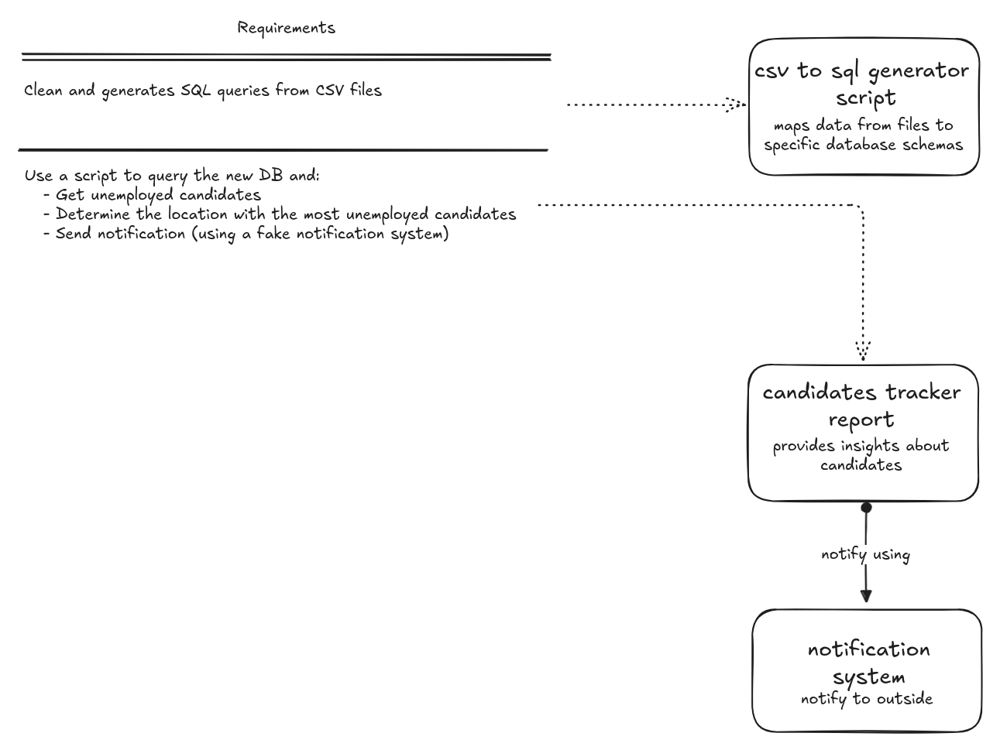
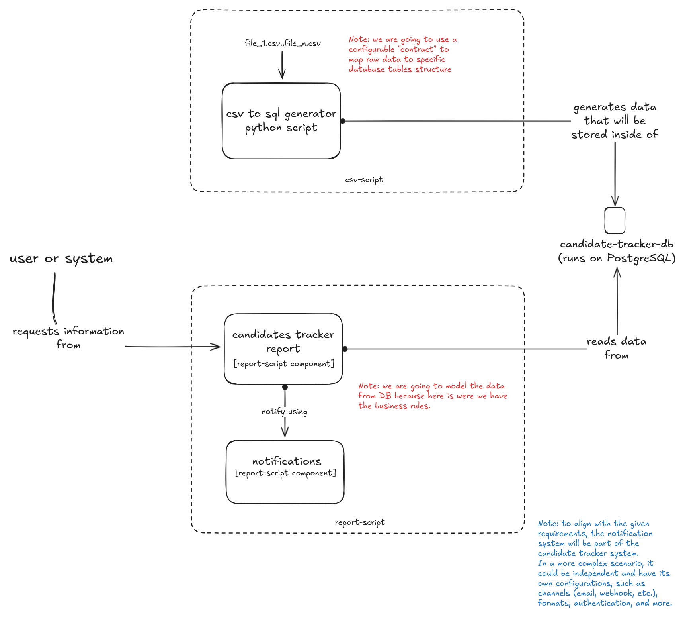

# Project Name: Candidate Tracker Report, CSV to SQL Script, and Calculator API

## Description

This fully dockerized project consists of two scripts and a small API.

The first script, **Candidate Tracker Report**, simulates a notification after gathering information about unemployed candidates, indicating which location has the highest number of unemployed candidates.

The second script, **CSV to SQL Script**, is a configurable script that takes multiple CSV files and transforms them into SQL queries. It includes a useful and optional command for minimal cleaning of the CSV files.

The API allows us to perform basic mathematical calculations with operands received in the payload.

### Analysis

The following analysis was conducted for the composition of the two scripts:





### Built with 🛠️

- **Language:** Python 3
- **Frameworks:** Flask, Click
- **Databases:** PostgreSQL

### Prerequisites 📋

- Docker

### Installation 🔧

- Clone the project.
- Run `docker-compose up --build` to start the service.
- Load the initial data using the following command:

```sh
docker exec -it candidate-tracker-postgres psql -U postgres -d candidate-tracker-db -f /data/inserts.sql
```

### Usage

This repository contains all the necessary files to generate the candidate report by location. You can directly execute the following command:

```sh
docker-compose run --rm report-script
```

#### Calculator API

To interact with the API, use the following cURL command:

```sh
curl -X POST "http://localhost:8000/calculate" \
     -H "Content-Type: application/json" \
     -d '{"expression": "2 + 3 * (4 - 1)"}'
```

#### CSV to SQL Generator

If you want to test the script used for cleaning and obtaining SQL queries, the following commands are available:

- Command to map data from CSV files to SQL:

```sh
docker-compose run --rm csv-script generate-sql-data
```

- Command to clean CSV files:

```sh
docker-compose run --rm csv-script clean-data files/candidate-tracker-db/original/ files/candidate-tracker-db/cleaned/
```

### Tests

To run the tests, start the services using `docker-compose up`, then to execute tests related to the `csv to sql generator`, run:

```sh
docker-compose run --rm csv-script python -m pytest
```
